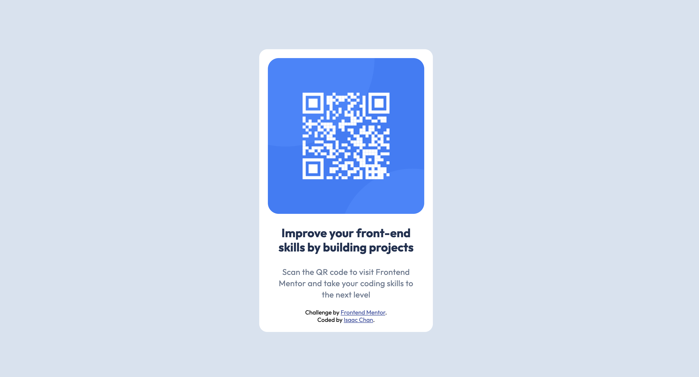

# Frontend Mentor - QR code component solution

This is a solution to the [QR code component challenge on Frontend Mentor](https://www.frontendmentor.io/challenges/qr-code-component-iux_sIO_H). Frontend Mentor challenges help you improve your coding skills by building realistic projects. 

## Table of contents

- [Frontend Mentor - QR code component solution](#frontend-mentor---qr-code-component-solution)
  - [Table of contents](#table-of-contents)
  - [Overview](#overview)
    - [Screenshot](#screenshot)
    - [Links](#links)
  - [My process](#my-process)
    - [Built with](#built-with)
    - [What I learned](#what-i-learned)
      - [The importance of semantic HTML](#the-importance-of-semantic-html)
    - [Continued development](#continued-development)
      - [Nesting](#nesting)
    - [Useful resources](#useful-resources)
  - [Author](#author)


## Overview

### Screenshot



### Links

- Solution URL: [GitHub solution repo](https://github.com/frymash/qr-code-component)
- Live Site URL: [GitHub solution live site](https://frymash.github.io/qr-code-component/)

## My process
1. Read through the first few sections of [Learn HTML](https://web.dev/learn/html) and [Learn CSS](https://web.dev/learn/css) courses from web.dev to understand the basics of HTML and CSS>
2. Created my GitHub repository for my solution.
3. Wrote my first drafts of the HTML and CSS solutions. These drafts contained the correct fonts, colors and layouts required for the solution. However, the paddings and spacings were still a little inaccurate. Magic numbers were also littered across the CSS solution.
4. Used the Figma file to help myself sort out the paddings and spacings. I also assigned each magic number to a named variable to make my CSS code more readable + organised.
5. Used some Googling and [ChatGPT](https://chatgpt.com/share/68f60838-8600-8005-bea4-ede1bb51e245) to clarify concepts I was unclear about (such as flexbox, viewports, and nesting)

### Built with

- Semantic HTML5 markup (to the best of my ability, at least!)
- Flexbox

### What I learned

#### The importance of semantic HTML
Although I did some reading on semantic HTML before working on my solution, my initial solution still contained a few `div`s here and there. I had written them because I needed to encapsulate certain inline elements (e.g. the QR code image) in blocks so that subsequent elements would be positioned under them rather than beside them.

For instance, I had encapsulated the QR code image in this way:
```html
      <div>
        
      </div>
```

...but of course, this didn't feel so intuitive. I wondered if I could do better and replace the `div` tag with a tag that made a bit more intuitive sense in the context of an image. After doing some research, I found out about the `picture` tag. Now, I'm not sure if `picture` is the most appropriate block I could encapsulate an image within. Regardless, `picture` self-explains its purpose more clearly than `div` does, so I made the necessary replacements.

```html
      <picture>
        
      </picture>
```


### Continued development

#### Nesting
For my CSS file, I'd intially thought of nesting every single component under their parent sections. I'm not entirely sure if doing so would be idiomatic. However, arranging the selectors in a hierarchical manner instead of chucking everything at top-level seems to make more sense to me. 

Since I'm pretty new to frontend development, I'll keep my solution simple and leave the selectors at top-level. Nevertheless, I have written an alternative CSS solution that utilises nesting:

```css
body {
    display: flex; /* flexboxes are used for one-dimensional layouts */
    align-items: center; /* vertical centering */
    justify-content: center; /* horizontal centering */
    height: 100vh;
    font-family: 'Outfit', sans-serif;
    background-color: var(--slate-300);
    
    & figcaption {
        text-align: center;
        width: var(--image-width);
        
        & #subtitle {
            color: var(--slate-900);
            font-size: var(--subtitle-font-size);
            font-weight: var(--subtitle-font-weight);
            line-height: var(--subtitle-line-height);
            letter-spacing: var(--subtitle-line-spacing);
        }
    
        & #subtext {
            color: var(--slate-500);
            font-size: var(--subtext-font-size);
            font-weight: var(--subtext-font-weight);
            line-height: var(--subtext-line-height);
            letter-spacing: var(--subtext-line-spacing);
        }
    }
    
    .attribution {
        font-size: 11px; 
        text-align: center;
        padding: 20px; 
    
        /* the following selector was previously a top-level selector titled .attribution a, 
        but we can nest it inside .attribution and add the & symbol to display the explicit
        relationship between the a selector and its parent .attribution selector */
        & a {
            color: var(--hyperlink-blue);
        }   
    }
    
    .box {
        display: flex;
        flex-direction: column;
        align-items: center;
        justify-content: center;
        background-color: var(--white);
        width: var(--image-width); /* don't fix the height so that it can adjust dynamically based on content */
        padding: 16px;
        border-radius: 15px; /* to round the corners of the box */
    
        & picture img {
            display: block; /* the img element is inline by default, so we must convert the image to a block element to centre it */
            width: var(--image-width);
            border-radius: 20px;
        }
    }
}
```

### Useful resources

- [web.dev - Learn CSS- Box Model](https://web.dev/learn/css/box-model) - The box model felt like the biggest CSS concept I needed to understand to move ahead with the assignment. Once I began to think of each CSS component as a box, I found it significantly easier to organise and design each component.

## Author

- GitHub - [Isaac Chan](https://www.github.com/frymash)
- Frontend Mentor - [@frymash](https://www.frontendmentor.io/profile/yourusername)
